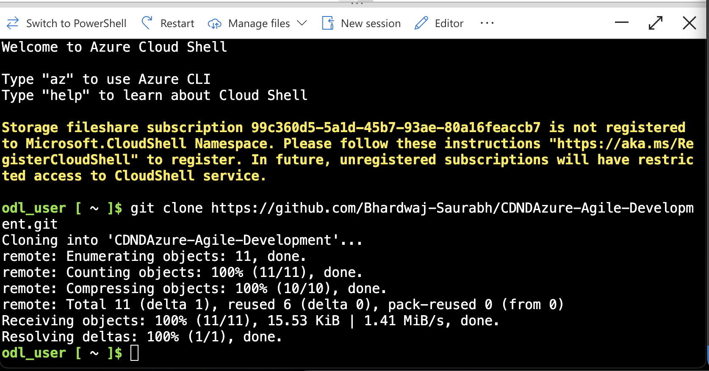
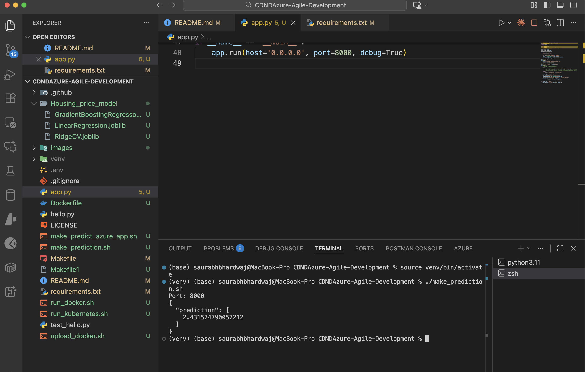
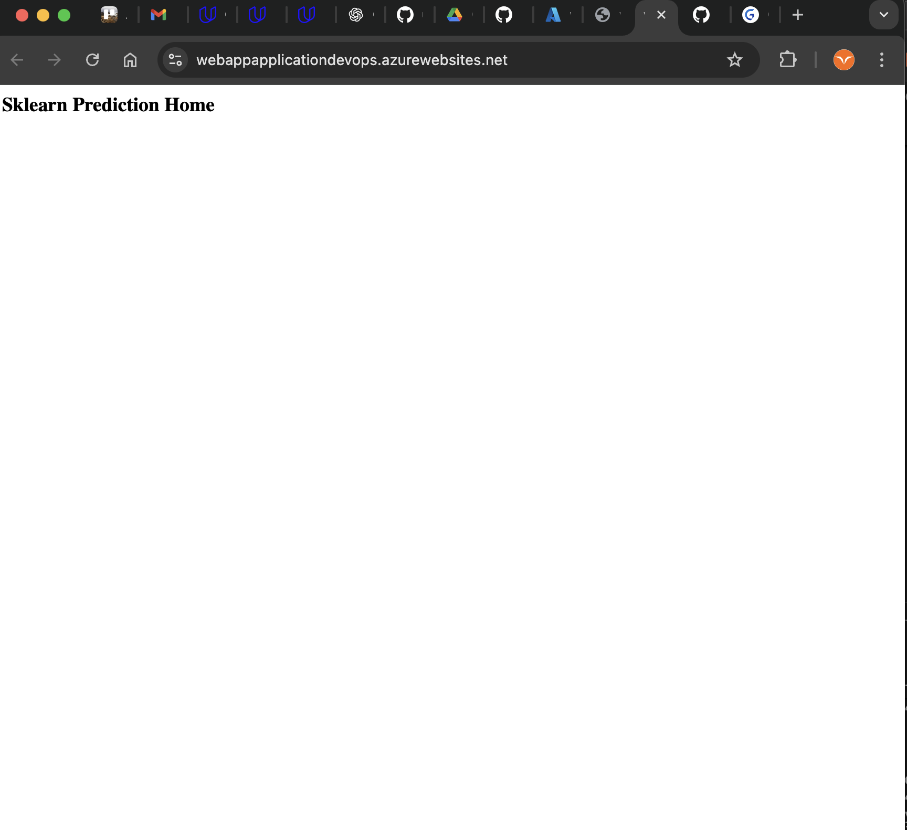
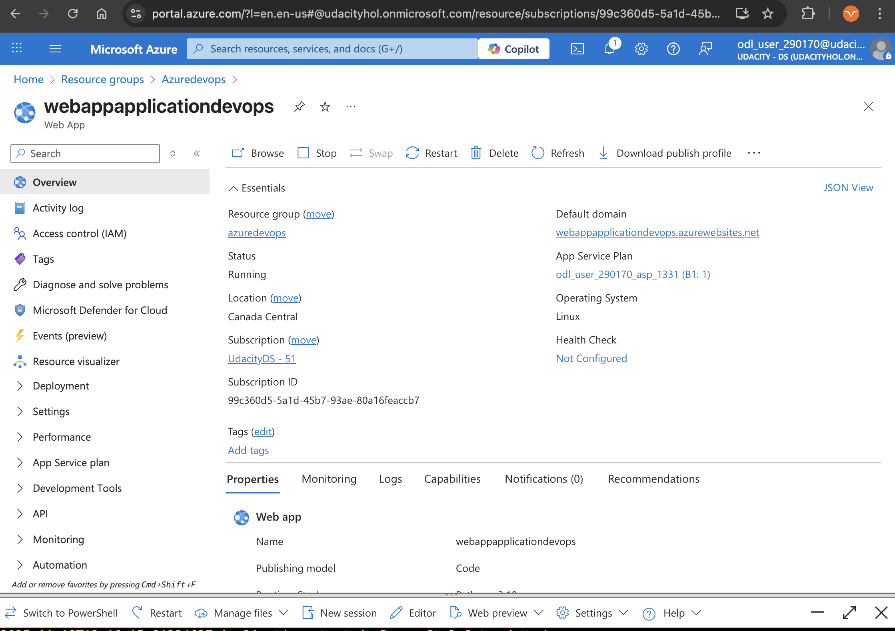
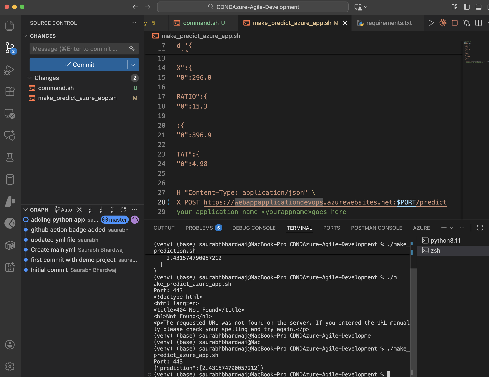
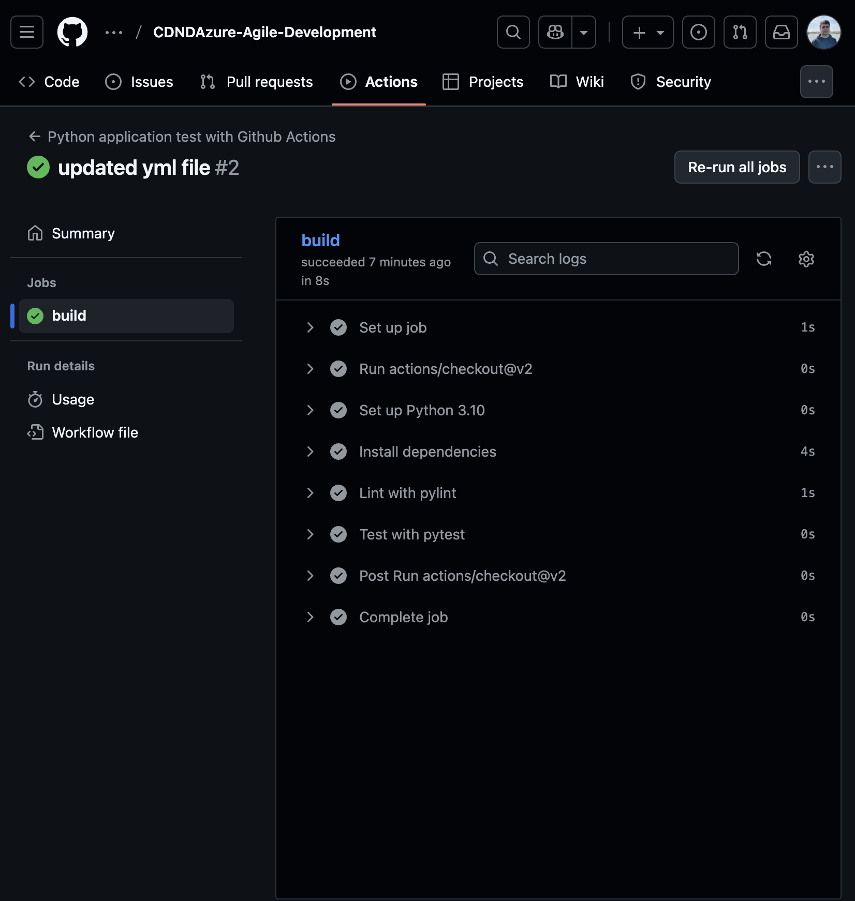
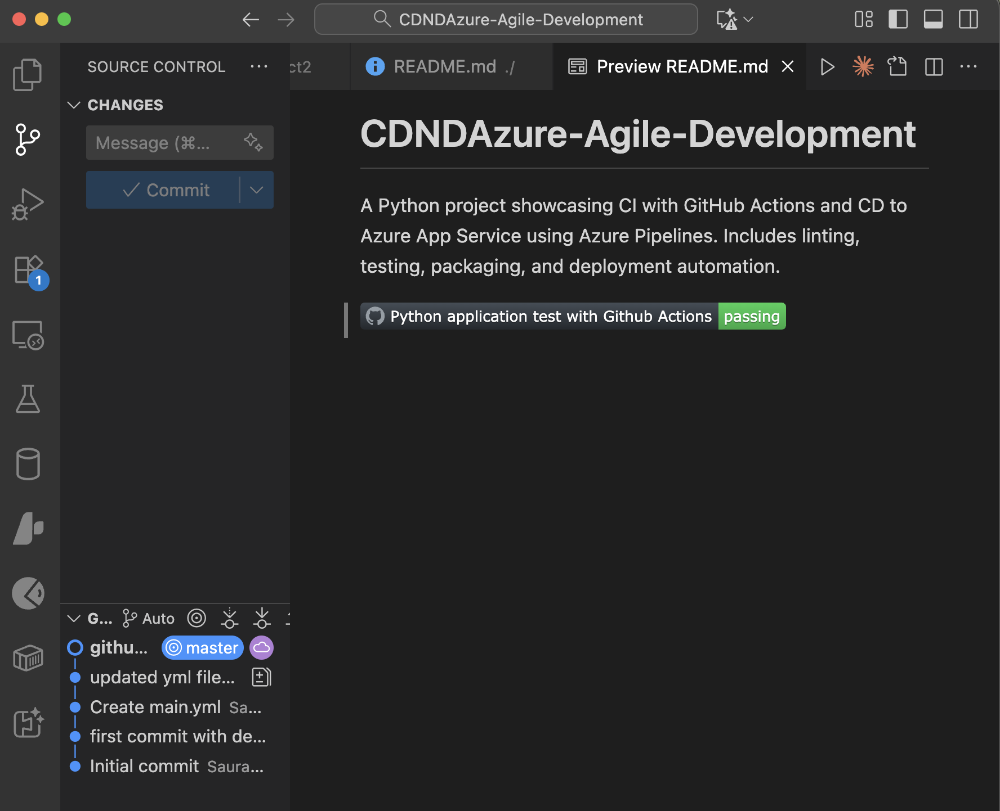
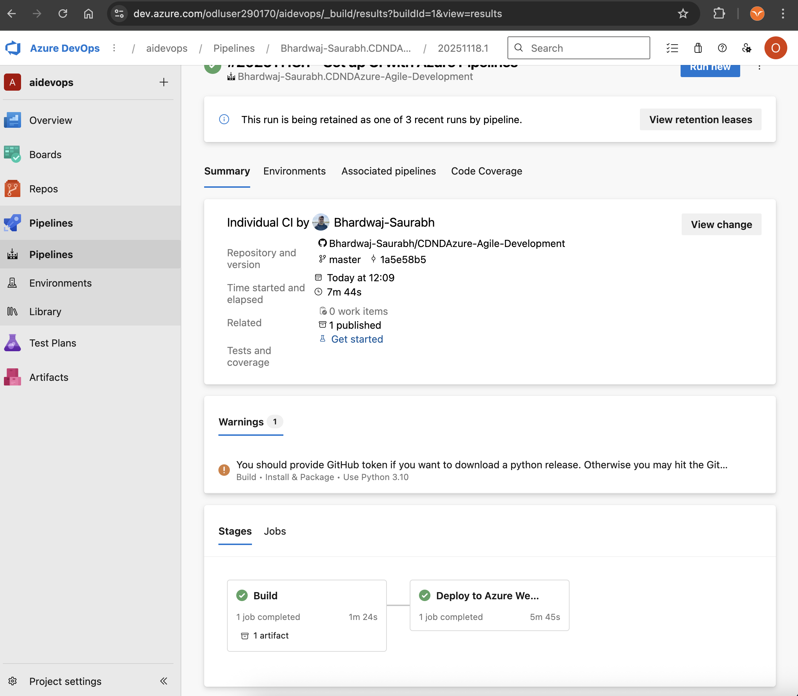

# Azure ML Housing Price Prediction - CI/CD Pipeline

[](https://dev.azure.com/odluser290170/aidevops/_build/latest?definitionId=1&branchName=master)

## Overview

This project demonstrates building a continuous delivery pipeline for a Python-based Machine Learning application using Azure DevOps. The application is a Flask web service that predicts housing prices in Boston using a pre-trained sklearn model. The project implements CI/CD best practices with GitHub Actions for continuous integration and Azure Pipelines for continuous deployment to Azure App Service.

### Key Features:
- Machine Learning Flask API for housing price predictions
- Automated testing with pytest
- Code quality checks with pylint
- Continuous Integration using GitHub Actions
- Continuous Deployment using Azure Pipelines
- Deployed on Azure App Service

## Project Plan

* [Trello Board](https://trello.com/b/WFJ4GZnq/azure-devops-nanodegee-project2) - Project management and task tracking
* [Project Spreadsheet](https://docs.google.com/spreadsheets/d/16D7efqFm5xXfVsjDsAhvdXBDYVfipi5b/edit?usp=drive_link&ouid=100693968475187864506&rtpof=true&sd=true) - Project timeline and quarterly planning

## Architectural Diagram

The following diagram shows the CI/CD pipeline architecture:

```
┌─────────────────┐
│   Developer     │
│   Local Dev     │
└────────┬────────┘
         │ git push
         ▼
┌─────────────────┐
│     GitHub      │
│   Repository    │
└────┬────────┬───┘
     │        │
     │        │ trigger
     ▼        ▼
┌─────────┐  ┌──────────────┐
│ GitHub  │  │    Azure     │
│ Actions │  │  Pipelines   │
│   CI    │  │     CD       │
└─────────┘  └──────┬───────┘
                    │
                    │ deploy
                    ▼
           ┌─────────────────┐
           │  Azure App      │
           │    Service      │
           │ (Web App)       │
           └─────────────────┘
```

**Pipeline Flow:**
1. Code is pushed to GitHub repository
2. GitHub Actions runs automated tests (lint, test)
3. Azure Pipelines triggers on successful tests
4. Application is deployed to Azure App Service
5. Service is accessible via HTTPS endpoint

## Instructions

### Prerequisites
- Azure Account
- GitHub Account
- Azure CLI installed
- Python 3.10 or higher

### Running the Project

#### 1. Clone the Repository to Azure Cloud Shell

Open Azure Cloud Shell and clone the repository:

```bash
git clone https://github.com/Bhardwaj-Saurabh/CDNDAzure-Agile-Development.git
cd CDNDAzure-Agile-Development
```



#### 2. Create Virtual Environment and Install Dependencies

```bash
python3 -m venv venv
source venv/bin/activate
make install
```

#### 3. Run Tests

Execute the test suite using the Makefile:

```bash
make all
```

This command will:
- Install dependencies
- Run pylint for code quality
- Execute pytest for unit tests


#### 4. Run Application Locally

```bash
python app.py
```

The application will start on `http://localhost:8000`

#### 5. Test Local Prediction

In a new terminal, run:

```bash
./make_prediction.sh
```



### Deploying to Azure App Service

#### 1. Create Azure App Service

```bash
az webapp up --name webappapplicationdevops --resource-group <your-resource-group> --runtime "PYTHON:3.10"
```



#### 2. Verify the Deployment

Navigate to your Azure App Service URL:
```
https://webappapplicationdevops.azurewebsites.net
```



#### 3. Test the Deployed Application

From Azure Cloud Shell, run the prediction script:

```bash
chmod +x make_predict_azure_app.sh
./make_predict_azure_app.sh
```

Expected output:
```bash
Port: 443
{"prediction":[20.35373177134412]}
```



### Setting Up CI/CD Pipeline

#### GitHub Actions (Continuous Integration)

The GitHub Actions workflow is configured in [.github/workflows/main.yml](.github/workflows/main.yml) and automatically:
- Runs on every push
- Sets up Python 3.10
- Installs dependencies
- Runs linting with pylint
- Executes tests with pytest




#### Azure Pipelines (Continuous Deployment)

1. Create a new pipeline in Azure DevOps
2. Connect to your GitHub repository
3. Configure the pipeline to deploy to Azure App Service
4. Pipeline automatically deploys on successful builds



### API Usage

The application exposes two endpoints:

**Home Endpoint:**
```
GET /
```

**Prediction Endpoint:**
```
POST /predict
Content-Type: application/json

{
   "CHAS":{"0":0},
   "RM":{"0":6.575},
   "TAX":{"0":296.0},
   "PTRATIO":{"0":15.3},
   "B":{"0":396.9},
   "LSTAT":{"0":4.98}
}
```

**Response:**
```json
{"prediction":[20.35373177134412]}
```

### Model Information

The application uses three pre-trained models located in `Housing_price_model/`:
- LinearRegression.joblib (default)
- StochasticGradientDescent.joblib
- GradientBoostingRegressor.joblib

Features used for prediction:
- **CHAS**: Charles River dummy variable (1 if tract bounds river; 0 otherwise)
- **RM**: Average number of rooms per dwelling
- **TAX**: Full-value property-tax rate per $10,000
- **PTRATIO**: Pupil-teacher ratio by town
- **B**: 1000(Bk - 0.63)^2 where Bk is the proportion of Black residents by town
- **LSTAT**: % lower status of the population

## Enhancements

Future improvements for this project:

1. **Model Improvements**
   - Implement model versioning and A/B testing
   - Add model monitoring and performance tracking
   - Retrain models periodically with new data
   - Add more sophisticated feature engineering

2. **Application Features**
   - Add authentication and rate limiting
   - Implement batch prediction endpoint
   - Create a web UI for easier interaction
   - Add request/response validation with schemas

3. **Infrastructure**
   - Implement blue-green deployment strategy
   - Add auto-scaling based on load
   - Set up proper monitoring with Azure Application Insights
   - Implement proper logging aggregation

4. **Testing**
   - Add integration tests
   - Implement load testing
   - Add security scanning to the pipeline
   - Increase test coverage to >90%

5. **DevOps**
   - Add staging environment
   - Implement infrastructure as code (Terraform/Bicep)
   - Add automated rollback on deployment failure
   - Implement feature flags for gradual rollouts

## Project Structure

```
.
├── .github/
│   └── workflows/
│       └── main.yml              # GitHub Actions CI workflow
├── Housing_price_model/          # Pre-trained ML models
│   ├── LinearRegression.joblib
│   ├── StochasticGradientDescent.joblib
│   └── GradientBoostingRegressor.joblib
├── images/                       # Screenshots for documentation
├── app.py                        # Flask application
├── requirements.txt              # Python dependencies
├── Makefile                      # Build automation
├── Dockerfile                    # Container configuration
├── make_prediction.sh            # Local prediction script
├── make_predict_azure_app.sh     # Azure prediction script
└── test_hello.py                 # Unit tests
```

## Technologies Used

- **Python 3.10** - Programming language
- **Flask** - Web framework
- **scikit-learn** - Machine learning library
- **pandas** - Data manipulation
- **pytest** - Testing framework
- **pylint** - Code quality tool
- **Azure App Service** - Hosting platform
- **Azure Pipelines** - CD platform
- **GitHub Actions** - CI platform

## Demo

[Demo - YouTube](https://www.youtube.com/watch?v=D9K2ZdeOfoU)

## License

This project is licensed under the MIT License - see the [LICENSE](LICENSE) file for details.

## Contributing

1. Fork the repository
2. Create a feature branch
3. Commit your changes
4. Push to the branch
5. Create a Pull Request

## Contact

For questions or support, please open an issue in the GitHub repository.
